  <picture>
    <source media="(prefers-color-scheme: dark)" srcset="https://raw.githubusercontent.com/JohnnyfiveAZR/JohnnyfiveAZR/output/github-contribution-grid-snake-dark.svg">
    <source media="(prefers-color-scheme: light)" srcset="https://raw.githubusercontent.com/JohnnyfiveAZR/JohnnyfiveAZR/output/github-contribution-grid-snake.svg">
    
  </picture>

<h1 align="center">🚀 Johnny Taylor's Portfolio</h1>
<h3 align="center">Networking • CyberSecurity • Vulnerability Management</h3>

  

  <picture>
    <source media="(prefers-color-scheme: dark)" srcset="assets/network-topology-dark.svg">
    <source media="(prefers-color-scheme: light)" srcset="assets/network-topology-light.svg">
    
  </picture>

---

 
 

## 📂 Projects

### 🛡️ DISA STIG Remediations
Defense Information Systems Agency Security Technical Implementation Guides

- 🚧 _Projects in progress — coming soon_

### ⚠️ Vulnerability Management
- 🔐 [Vulnerability Management Program Implementation](https://github.com/JohnnyfiveAZR/vulnerability-management-program)

### 🕵️ Threat Hunting
- 🧅 [Threat Hunt: Unauthorized TOR Usage](https://github.com/JohnnyfiveAZR/Tor-Threat-Hunt/tree/main/tor-threat-hunt)

### 🌐 Networking
- 🚧 _Projects in progress — coming soon_

### 💻 Information Technology
- ☁️ [Configuring On-Premises Active Directory within Azure VMs](https://github.com/JohnnyfiveAZR/Microsoft-Azure)

---

## 🤝 Connect With Me

 

<!-- Generated by build_profile.py — edit the script, not this file. -->
